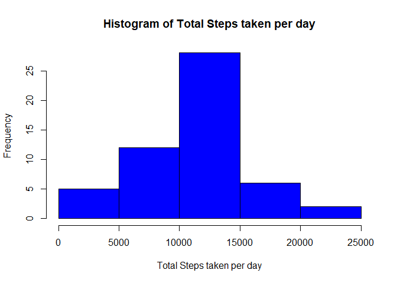

# Reproducible Research: Peer Assessment 1


## Loading and preprocessing the data


```r
setwd("D:/GitHub/RepData_PeerAssessment1")

if(!(file.exists("activity.csv"))) { 
    
    fileName <- "activity.zip"
    if(!file.exists(fileName)) {
        fileURL <- "https://d396qusza40orc.cloudfront.net/repdata%2Fdata%2Factivity.zip"
        download.file(url=fileURL,destfile=fileName,mode="wb")
    }  
    unzip(fileName) 
}

activity <- read.table("activity.csv", sep=",", header=T)
```


## What is mean total number of steps taken per day?

Preprocess the data to pivot steps by date

```r
totalSteps <- aggregate(steps ~ date, data=activity, sum, na.rm = TRUE)
```
Frequency of average steps per day

```r
hist(totalSteps$steps,col="blue",main="Histogram of Total Steps taken per day",xlab="Total Steps taken per day",cex.axis=1,cex.lab = 1)
```

<!-- -->


Mean steps per day


```r
mean(totalSteps$steps)
```

```
## [1] 10766.19
```

Median of steps per day


```r
median(totalSteps$steps)
```

```
## [1] 10765
```

## What is the average daily activity pattern?
Create a plot of average steps taken by day
Make a time series plot (i.e. type = "l") of the 5-minute interval (x-axis) and the average number of steps taken, averaged across all days (y-axis)


```r
steps_interval <- aggregate(steps ~ interval, data = activity, mean, na.rm = TRUE)

plot(steps ~ interval, data = steps_interval, type = "l", xlab = "Time Intervals (5-minute)", ylab = "Mean number of steps taken (all Days)", main = "Average number of steps Taken at each 5 minute Intervals",  col = "blue")
```

<!-- -->

#### Which 5-minute interval, on average across all the days in the dataset, contains the maximum number of steps?


```r
maxStepInterval <- steps_interval[which.max(steps_interval$steps),"interval"]
```

The 835th interval contains the maximum number of steps


## Imputing missing values
Determine the number of incomplete rows


```r
missing_values <- sum(!complete.cases(activity))
```

* The number of missing values (i.e. NA) in the dataset is 2304 

Substitute the missing values with the mean steps for that interval. Let's first create a function so that we can re-use the calc. We'll pass in the interval to calc for.

```r
getAvgPerInterval <- function(interval){
    steps_interval[steps_interval$interval==interval,"steps"]
    }
```

Create a new dataset with the missing values substituted

```r
newActivity <- activity

## Loop to go thru each row, and if it has missing value, call the fx to get the mean value for that interval across all days
counter = 0
for (i in 1:nrow(newActivity)) {
    if (is.na(newActivity[i,"steps"])) {
        newActivity[i,"steps"] <- getAvgPerInterval(newActivity[i,"interval"])
        counter = counter + 1
        }
}
```
* Rows substituted: 2304

Create a histogram of the total number of steps taken each day and 


```r
totalStepsPerDay <- aggregate(steps ~ date, data = newActivity, sum)
hist(totalStepsPerDay$steps, col = "blue", xlab = "Total Number of Steps", 
     ylab = "Frequency", main = "Histogram of Total Number of Steps taken each Day")
```

<!-- -->

Calculate and report the mean and median total number of steps taken per day. 

```r
newMeanStepsPerDay <- mean(totalStepsPerDay$steps)
newMedianStepsPerDay <- median(totalStepsPerDay$steps)
```
* The mean steps per day is 1.0766189\times 10^{4}.
* The median steps per day is 1.0766189\times 10^{4}

#### Do these values differ from the estimates from the first part of the assignment? What is the impact of imputing missing data on the estimates of the total daily number of steps?

* Original mean steps per day:  1.0766189\times 10^{4}
* New means steps per day:      1.0766189\times 10^{4}
* Difference                    0
* Conclusion: The mean steps per day stayed the same

* Original median steps per day:    10765
* New median steps per day:         1.0766189\times 10^{4}
* Difference                        -1.1886792
* Conclusion: The median steps increased using the imputed values for the missing data points.


## Are there differences in activity patterns between weekdays and weekends?

Create a new factor variable in the dataset that differentiates between weekday and weekends (i.e. Monday-Friday vs. Saturday/Sunday).

```r
newActivity$day <- ifelse(as.POSIXlt(as.Date(newActivity$date))$wday%%6 ==0, "weekend", "weekday")

newActivity$day <- factor(newActivity$day, levels = c("weekday", "weekend"))
```

Make a panel plot containing a time series plot (i.e. type = "l") of the 5-minute interval (x-axis) and the average number of steps taken, averaged across all weekday days or weekend days (y-axis).


```r
meanStepsByIntervalDay <- aggregate(steps ~ interval + day, newActivity, mean)

library(lattice)

xyplot(steps ~ interval | factor(day), data = meanStepsByIntervalDay, aspect = 1/2, type = "l")
```

<!-- -->
